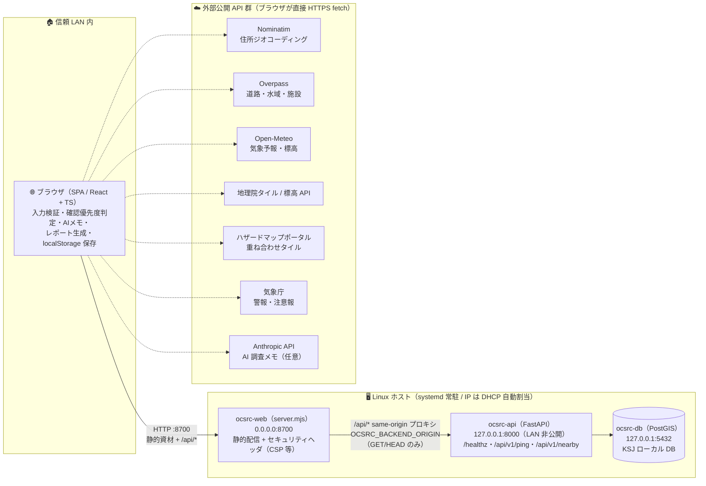

# Open Civil Site Risk Checker（工事候補地リスクチェッカー）

住所または緯度経度を入力すると、工事候補地周辺の **道路・河川・災害・地形・気象・施設** の公開データを横断取得し、**確認優先度（A〜D）つき**で一覧化する初期調査支援アプリです。

> **本ツールは施工可否・安全性・法的適合性を断定しません。**
> 「データなし」は「リスクなし」を意味しません。候補地検討の初期段階で「追加確認すべき論点」を早く見つけることを目的とします。

このリポジトリは Claude Design のデザインプロトタイプ（`docs/site-risk-checker.design.dc.html`）を、実 API 連携つきの動く Web アプリとして実装した **MVP（Phase 1）** です。

📁 ドキュメントの正本は `docs/` 配下です（要件定義 `docs/requirements.md` / 詳細仕様 `docs/detailed-specification.md` / 概要 `docs/overview.md`）。

---

## 🚀 クイックスタート

```bash
cd frontend
npm install
npm run dev          # 開発サーバ（http://localhost:5173）
```

その他のスクリプト:

```bash
npm run build        # 型チェック + 本番ビルド（dist/）
npm run preview      # ビルド成果物のプレビュー
npm run lint         # ESLint
npm run typecheck    # tsc --noEmit
npm test             # ユニットテスト（vitest, 1回実行）
npm run test:watch   # ユニットテスト（vitest, watch）
npm run test:smoke   # スモークテスト（esbuild ランナー / 制約環境向け）
```

ブラウザで開いたら、**「サンプル地点で試す（霞が関）」** ボタンで一連の流れ（取得 → 地図 → 確認結果 → AIメモ → レポート）を確認できます。

---

## 🌐 常駐サービス（WebUI 公開）

ビルド成果物（`frontend/dist`）を依存ゼロの静的サーバ（`frontend/server.mjs`）で配信し、常時起動します。サーバは `HOST=0.0.0.0` でバインドするため、**ホストに自動割当された IP（DHCP）を含む全インタフェース**で到達でき、ポートは**競合しない番号を自動選択**します（既定は 8700〜8799 から空きを探索）。`server.mjs` は静的配信に加えて**セキュリティヘッダの付与**と **`/api/*` の same-origin プロキシ**（バックエンド API への中継）も担います（[アーキテクチャ](#-アーキテクチャ)参照）。

現在の稼働 URL（Linux ホスト `kensan1969` / systemd 常駐 / IP は DHCP 自動割当）:

| 種別                       | URL                                    |
| -------------------------- | -------------------------------------- |
| LAN（自動割当 IP・現在値） | `http://192.168.0.185:8700/`           |
| ローカル                   | `http://127.0.0.1:8700/`               |
| ヘルスチェック             | `http://127.0.0.1:8700/healthz` → `ok` |

> LAN の IP は DHCP 割当のため環境や再起動のタイミングで変わり得ます。固定 IP をコードや設定に書き込む必要はありません（`server.mjs` は `HOST=0.0.0.0` で全インタフェース待受のため、どの IP が割り当たっても自動的に到達可能）。現在値を確認したい場合は `scripts/install-systemd.sh` の実行結果（`LAN: http://<IP>:<PORT>/` 行）、または `hostname -I` / `ip route get 1.1.1.1` を使用してください。

### A. systemd（既定・稼働中・Linux ネイティブ）

```bash
scripts/install-systemd.sh          # ビルド → ユニット生成 → enable --now（ポート自動選択）
PORT=8750 scripts/install-systemd.sh # ポートを明示する場合
scripts/uninstall-systemd.sh        # 停止・無効化・ユニット削除
```

`/etc/systemd/system/ocsrc-web.service` を生成し、`enable`（再起動後も自動起動）＋ `Restart=always`（異常終了時も自動復帰）で常駐します。

```bash
systemctl status ocsrc-web      # 状態確認
sudo systemctl restart ocsrc-web
journalctl -u ocsrc-web -f      # ログ追従
```

> コード更新後は `scripts/install-systemd.sh` を再実行（再ビルド＋再起動）すれば反映されます。ポートは既存ユニットの値を引き継ぎます。

> 🚀 **バックエンド API（KSJ 空間検索）も常駐させる場合**は `scripts/install-systemd-api.sh` を実行します（`ocsrc-api.service`・127.0.0.1 バインド・web へのプロキシ先自動注入）。DB（PostGIS）起動・パスワード設定を含む全体手順の正本は [`docs/deploy-backend.md`](docs/deploy-backend.md) を参照してください。

### B. Docker（代替・別ホスト向け）

> 📌 現在の本番稼働は上記 A（systemd / Linux ホスト `kensan1969` / 自動割当 IP）です。本節は Windows ホスト等、systemd が使えない環境で Docker を使う場合の代替手順として保持しています。

systemd の代わりに Docker で常駐させる場合（`restart: always` で再起動後も自動起動）:

```bash
cd infra
OCSRC_PORT=8700 docker compose up -d --build
docker compose logs -f
docker compose down               # 停止
```

> systemd と Docker は同一ポートを使うため、**どちらか一方**を使用してください。

> ⚠️ **Windows ホストでの既知の落とし穴**: `restart: always` はコンテナ自身の再起動を担保しますが、
> Docker Desktop（Docker エンジン）そのものが起動していなければコンテナは復帰しません。Docker Desktop の
> 既定は「ログイン時に自動起動しない」設定のため、Windows 再起動後にサイトが接続拒否になることがあります
> （2026-07-05 に本番 `http://192.168.0.143:8700/` で実際に発生・復旧済み）。対策として、ログオン時に
> Docker Desktop を起動するタスクを登録済みです:
>
> - スクリプト: `scripts/ops/Start-DockerDesktop.ps1`
> - タスク名: `OCSRC-DockerDesktop-AutoStart`（Task Scheduler / ログオン時トリガー）
> - 確認: `Get-ScheduledTask -TaskName OCSRC-DockerDesktop-AutoStart`

### C. ロールバック（切り戻し）手順

デプロイ後に問題が見つかった場合は、**コードを直前の正常版へ戻して再ビルド・再起動**します。履歴改変（force push）は行わず、`git revert` で戻します。

```bash
# 1. 戻したいコミットを特定（直前のマージなら HEAD）
git log --oneline -5

# 2. 対象コミットを打ち消すコミットを作成（マージコミットは -m 1）
git revert <commit>            # 通常コミット
git revert -m 1 <merge-commit> # マージコミット

# 3. 再ビルド + 再起動（稼働方式に応じてどちらか）
scripts/install-systemd.sh                    # systemd の場合（再ビルド + 再起動）
cd infra && docker compose up -d --build      # Docker の場合
```

確認:

```bash
curl -fsS http://127.0.0.1:8700/healthz   # → ok
systemctl status ocsrc-web                # systemd の場合
docker compose ps                         # Docker の場合
```

> 本アプリは静的 SPA（サーバ側状態なし・DB なし）のため、ロールバックはビルド成果物の差し替えのみで完結します。利用者データは各ブラウザの `localStorage` にあり、ロールバックの影響を受けません（スキーマ変更を伴う変更を戻す場合のみ、README の該当バージョンの記載を確認してください）。

---

## 📋 実装済み機能（MVP / 受入条件 AC-001〜010 対応）

| 画面                     | 内容                                                                                                                                                                                                                                                                                                                                |
| ------------------------ | ----------------------------------------------------------------------------------------------------------------------------------------------------------------------------------------------------------------------------------------------------------------------------------------------------------------------------------- |
| SCR-000 ダッシュボード   | 既定の起動画面。調査案件一覧・KPI・確認優先度の全体集計。**本番データ（実取得）案件**と**ダミー（サンプル）案件**を区別表示。JSON 取込/エクスポート対応                                                                                                                                                                             |
| SCR-001 地点入力         | 住所 / 緯度経度・検索半径（100m〜3km）・確認カテゴリ選択、入力検証                                                                                                                                                                                                                                                                  |
| SCR-002 リスク判定       | 地図（地理院タイル＋実ジオメトリ）、確認優先度サマリー、カテゴリ別結果一覧                                                                                                                                                                                                                                                          |
| SCR-003 リスク詳細       | 根拠データ・出典・取得日時・距離・注意事項・コメント欄（右ドロワー）                                                                                                                                                                                                                                                                |
| SCR-004 AI調査メモ       | 断定表現を避けた調査メモを自動生成・編集・再生成。**AI生成（Anthropic Claude・SCR-008 の保存キー利用）**に対応：テンプレートを土台に生成し、禁止表現チェック + 免責文必須化を通す                                                                                                                                                   |
| SCR-005 レポート出力     | Markdown / CSV 出力（公開区分つき、UTF-8 BOM 付き CSV）                                                                                                                                                                                                                                                                             |
| SCR-006 データソース管理 | 接続状態・利用条件の台帳、接続テスト（実疎通）                                                                                                                                                                                                                                                                                      |
| SCR-007 取得ログ         | 実行履歴（成功 / 失敗 / タイムアウト / スキップを区別）                                                                                                                                                                                                                                                                             |
| SCR-008 システム設定     | AI設定（**Anthropic（Claude）専用**・APIキー入力/クリア/接続テスト/保存）+ **バックエンド接続（KSJ連携）**（既定は「このサイト経由（/api プロキシ）」・カスタム URL の保存/解除・接続テスト。ビルド不要で即時反映）+ **地点確認の既定値**（既定検索半径・既定カテゴリ）+ **ローカルデータ管理**（全削除・二段階確認）+ アプリ情報。**すべてブラウザの localStorage のみに保存** |

### 🔌 連携している公開データソース（ブラウザ直接呼び出し）

| ソース                    | 用途                                             | 連携状態                                                      |
| ------------------------- | ------------------------------------------------ | ------------------------------------------------------------- |
| OpenStreetMap / Nominatim | 住所ジオコーディング                             | ✅ 実連携                                                     |
| OpenStreetMap / Overpass  | 周辺道路・水域・施設・駅（実距離計測）           | ✅ 実連携                                                     |
| Open-Meteo                | 7日予報（強雨・強風の抽出）                      | ✅ 実連携                                                     |
| 国土地理院 地理院タイル   | 背景地図（淡色/標準/写真）・標高                 | ✅ 実連携                                                     |
| ハザードマップポータル    | 洪水浸水想定・土砂災害の重ね合わせタイル         | ✅ 実連携（視覚確認向け）                                     |
| 国土数値情報 (KSJ)        | 河川・施設（ローカルDB / PostGIS 空間検索）      | ✅ 実連携（既定: same-origin `/api` プロキシ経由・Phase 2）   |
| 気象庁 警報・注意報       | 都道府県（気象庁発表単位）の警報・注意報発表状況 | ✅ 実連携（Phase 3・認証不要・CORS開放）                      |
| PLATEAU                   | 3D都市モデル                                     | ⏳ タイムアウト再現（取得失敗の扱いを実証）                   |
| xROAD                     | 道路交通量                                       | ⏸ 未連携（利用規約同意が必要）                                |

> ハザードの重なり判定はクライアント側では行わず、タイル重ね合わせによる**視覚確認**として表示します（出典明示・断定回避）。KSJ はバックエンド停止・DB 未整備時に「取得失敗」、PLATEAU / xROAD は「未連携」として誠実に区別表示します（要件 FR-503 / NFR-504）。
>
> **気象庁 警報・注意報連携（Phase 3・Issue #22）**: 地点の都道府県を Nominatim 逆ジオコーディングで特定し、`https://www.jma.go.jp/bosai/warning/data/warning/{都道府県コード}.json` を直接取得します（バックエンド不要）。表示文は気象庁自身が作成した `headlineText` をそのまま採用し、アプリ側で警報名を合成しません。**北海道・鹿児島県・沖縄県は地域ごとに気象台が分かれ単一コードを持たないため、人口の多い代表地域（札幌／鹿児島県本土／沖縄本島）の発表状況を表示し、その旨を確認結果の注意事項に明記**します。

---

## 🧪 品質ゲート / テスト

ローカル実行コマンド（フロントエンド `frontend/`）:

| ゲート         | コマンド             | 内容                                      |
| -------------- | -------------------- | ----------------------------------------- |
| Lint           | `npm run lint`       | ESLint（TypeScript + React Hooks ルール） |
| 型チェック     | `npm run typecheck`  | `tsc --noEmit`（テストファイル含む）      |
| ユニットテスト | `npm test`           | vitest（純粋ロジックの回帰防止）          |
| スモークテスト | `npm run test:smoke` | esbuild ランナー（環境非依存の二重検証）  |
| ビルド         | `npm run build`      | 本番ビルド成功確認                        |

ローカル実行コマンド（バックエンド `backend/`）:

| ゲート         | コマンド       | 内容                                       |
| -------------- | -------------- | ------------------------------------------ |
| Lint           | `ruff check .` | Python Lint                                |
| ユニットテスト | `pytest`       | KSJ パース・API・取込 CLI（PostGIS 統合テストは DB 到達時のみ） |

### 🎯 テスト対象（純粋ロジック）

DOM 非依存の純粋関数を中心に検証します。とくに**「断定表現を出力しない」コンプライアンス制約**（要件 §3.2）を回帰テストで保証します。

- `src/risk/memo.ts` — AI調査メモ生成（免責文の必須化・根拠データ紐付け・8セクション構成）
- `src/report/markdown.ts` — Markdown レポート（免責文・公開区分・優先度集計）
- `src/report/csv.ts` — CSV 生成（RFC 4180 エスケープ・距離丸め・出典連結）
- `src/api/geo.ts` — Haversine 距離・bbox（WGS84）
- `src/api/jmaWarning.ts` — 都道府県→気象庁コード変換、警報コード→名称、発表中警報の抽出・確認項目化
- `src/data/constants.ts` — ラベル辞書の網羅性・「該当なし／データ未取得」の区別

### 🔁 二重ランナー構成（vitest + esbuild スモーク）

テスト本体は1つ（`src/**/*.test.ts`, `import ... from 'vitest'`）で、2つのランナーから実行します。

- **vitest**（CI・通常環境）: `npm test`。
- **esbuild スモーク**（`scripts/smoke-test.mjs`）: `npm run test:smoke`。`'vitest'` を極小 shim（`scripts/smoke/shim.mjs`）に alias し、esbuild で単一バンドル化して node 上で実行します。仮想メモリ `ulimit` 制約により Vite/WASM 系ツールが起動できない環境でも、同じテスト資産をそのまま検証できます。

### ⚙️ CI（`.github/workflows/ci.yml`）

`main` への push / PR で以下の 3 ジョブを実行します。

| ジョブ       | 環境                                 | 内容                                                                     |
| ------------ | ------------------------------------ | ------------------------------------------------------------------------ |
| 🖥 frontend  | Node 22                              | `npm ci` → lint → typecheck → vitest → smoke → build                     |
| 🐍 backend   | Python 3.12 + PostGIS サービスコンテナ | ruff → pytest（KSJ 空間検索の**実 DB 統合テスト**含む）                  |
| 🔐 security  | Node 22 / Python 3.12                | `npm audit --audit-level=high` + `pip-audit`（既知脆弱性検出で fail）    |

補助的な自動化・対策:

- 🤖 **Dependabot**（`.github/dependabot.yml`）: npm / pip / GitHub Actions の 3 エコシステムを**週次**で更新チェックし PR を自動作成
- 🛡️ Actions はコミット **SHA でピン留め**（サプライチェーン対策）、`permissions: contents: read`、`persist-credentials: false`

---

## 🏗 アーキテクチャ

### 🗺️ システム全体（現行）

本アプリは**フロントエンド中心の SPA** です。リスク判定・AI 調査メモ・レポート生成はすべてブラウザ内の TypeScript で実行し、外部公開 API はブラウザが直接 fetch します。バックエンド（FastAPI + PostGIS）は国土数値情報（KSJ）の空間検索補助に限定され、`server.mjs` の **`/api/*` same-origin プロキシ**経由で到達します（API 自体は 127.0.0.1 バインドで LAN へ直接露出しません）。



| コンポーネント | 役割 | 備考 |
| -------------- | ---- | ---- |
| SPA（ブラウザ） | 取得・判定・メモ・出力のすべて | 利用者データは `localStorage` のみ（サーバ側に保存しない） |
| `frontend/server.mjs`（ocsrc-web） | 静的配信 / セキュリティヘッダ / `/api/*` プロキシ | 依存ゼロ Node。転送先は環境変数固定（SSRF 防止） |
| `backend/`（ocsrc-api） | KSJ 空間検索 API（読み取り専用 3 エンドポイント） | 127.0.0.1 バインド。SPA は**既定で same-origin `/api` プロキシ経由**で接続（Issue #57・カスタム URL で直結も可） |
| PostGIS（ocsrc-db） | KSJ 取込データの近傍検索（`ST_DWithin`） | `python -m app.ingest` で取込（冪等） |

> 📖 仕様の正本: 実装アーキテクチャの詳細は [`docs/detailed-specification.md`](docs/detailed-specification.md) §3、バックエンド中心構成（認証・案件管理）は同 §3.4 の**将来計画（Phase 4+）**として整理しています。

### 📁 フロントエンド構成

```
frontend/src/
├── types.ts            ドメイン型（Finding / Evidence / Source / Log …）
├── store.tsx           状態管理（Context + フック。デザインの setState を移植）
├── decorate.ts         表示用の色・ラベル付与
├── cssToStyle.ts       CSS文字列 → React style 変換ヘルパ
├── data/               定数（PRIO/STATUS/ラベル）・ソース台帳・フォールバック fixtures
├── api/                ★ アダプタ層（要件 NFR-401）
│   ├── http.ts         タイムアウト・計測つき fetch ラッパ
│   ├── geo.ts          Haversine 距離・bbox（WGS84）
│   ├── nominatim.ts    ジオコーディング
│   ├── overpass.ts     道路・水域・施設取得 → 最寄り距離・確認項目化
│   ├── openMeteo.ts    気象予報 → 確認項目化
│   ├── elevation.ts    標高（地理院 → Open-Meteo フォールバック）
│   ├── jmaWarning.ts   気象庁 警報・注意報（都道府県コード変換 → 発表状況の確認項目化）
│   ├── ping.ts         接続テスト
│   └── runAnalysis.ts  オーケストレーション（並行取得・部分結果・誠実な失敗表現）
├── risk/memo.ts        AI調査メモ生成（断定表現を避ける）
├── report/             Markdown / CSV レポート生成
├── map/SiteMap.tsx     Leaflet 地図（地理院/ハザードタイル + 実ジオメトリ）
├── components/         Header / Sidebar / Footer / LoadingOverlay / FindingDrawer
└── screens/            SCR-001〜007 各画面
```

### 📥 本番データ（調査案件）の投入

ダッシュボード（SCR-000）の調査案件は2種類を区別表示します。

- **実データ（本番）**：実際の地点確認結果を SCR-002 の「ダッシュボードに保存（本番データ）」で保存したもの。`localStorage`（キー `ocsrc-cases`）に永続化され、確認結果スナップショット（findings・出典・取得日時）ごと保存されるため「開く」で再取得せず復元表示します。`実データ` タグ付き・削除可。
- **ダミー（サンプル）**：`src/data/cases.ts` の6件（`isDummy:true`）。`ダミーデータ` タグを明記。「開く」は座標で実取得を実行します。**本番ビルドでは既定で非表示**（下記トグル）。

#### ダミーデータの表示トグル（本番非表示）

ダミー6件の表示有無はビルド時に切り替わります。

| ビルド                               | 既定の表示 | 備考                                       |
| ------------------------------------ | ---------- | ------------------------------------------ |
| `npm run dev`                        | 表示       | 開発・動作確認用                           |
| `npm run build`（本番）              | **非表示** | 実行 JS バンドルからも除去（tree-shaking） |
| `VITE_SHOW_DUMMY=true npm run build` | 表示       | デモ用に本番でもダミーを出したい場合       |
| `VITE_SHOW_DUMMY=false npm run dev`  | 非表示     | 開発中に本番相当を確認したい場合           |

> 環境変数 `VITE_SHOW_DUMMY`（`'true'`/`'false'`）が最優先。未指定時は dev=表示 / 本番=非表示。`scripts/install-systemd.sh` は `npm run build`（本番）を実行するため、**常駐サービスは既定でダミー非表示**になります。

投入経路:

1. **地点確認 → 保存**：地点確認を実行し、SCR-002 右パネルの「＋ ダッシュボードに保存（本番データ）」を押す。
2. **JSON 一括取込**：ダッシュボード右上「↑ 本番データ取込」から JSON 配列を取り込む。各要素は最低 `name` / `lat` / `lon` が必要（`radius` / `counts` / `status` 等は任意、未指定は補完）。緯度経度は WGS84 範囲で検証し、範囲外は除外します（要件 NFR-501/505）。
3. **エクスポート**：「↓ エクスポート」で実データのみ JSON 出力（バックアップ・他環境移行用、ダミーは対象外）。

> データの出所は `isDummy` フラグで常に追跡可能で、集計（KPI・優先度分布）はダミー込みの全件を対象にしつつ件数の内訳（実データ / ダミー）を併記します。

### 🎨 テーマ（ライト / ダーク）

ヘッダーのトグルでライト/ダークを切り替えます。構造色は CSS 変数（`src/styles.css` の `:root` / `:root[data-ocsrc-theme='dark']`）、意味色（確認優先度 A〜D・状態・案件状態）は JS のテーマ別パレット（`getPrio(theme)` 等）で解決します。地図はダーク時にタイルペインへ `filter: invert(...)` を当ててダーク地図化します。選択は `localStorage` に保存され、`data-ocsrc-theme` 属性で適用されます。

### 💡 設計上の重要方針

1. **断定しない**：「安全 / 危険 / 施工可否 / リスクなし」を使わず、「要確認 / 追加確認推奨 / 参考情報 / データ不足」で表現する（要件 §3.2）。
2. **アダプタ方式**：データソースは `src/api/` のアダプタに分離し、追加・差し替えを容易にする（要件 NFR-401/402）。将来のバックエンド（FastAPI）へ移設しやすい契約（`AdapterResult`）を採用。
3. **出典と取得日時の明示**：すべての確認項目に根拠データ・出典・取得日時・注意事項を紐付ける（要件 NFR-301）。
4. **「該当なし」と「取得失敗」の分離**：データ整備範囲内の「該当なし」と、API 失敗・未連携を必ず区別する（要件 FR-304 / NFR-504）。

---

## 🐍 バックエンド（KSJ 空間検索・Phase 2 稼働中）

`backend/` の FastAPI バックエンドは、国土数値情報（KSJ）のローカル DB 化（PostgreSQL + PostGIS）と空間検索 API を提供します。エンドポイントは**読み取り専用の 3 つ**（`/healthz` / `/api/v1/ping` / `/api/v1/nearby`）です。

開発時（Docker で DB + backend を起動）:

```bash
cd infra
cp .env.example .env                          # DB パスワード等（コミット禁止・本番は強パスワード必須）
docker compose --profile phase2 up -d --build # db(PostGIS) + backend を起動
curl http://127.0.0.1:8000/healthz            # → {"status":"ok","db":"ok",...}
```

- 既定の `docker compose up`（フロント配信のみ）には**影響しません**（profile 分離）
- 🚀 **本番デプロイ（systemd）**: `scripts/install-systemd-api.sh` で `ocsrc-api.service` を常駐化します（venv 自動構築・**127.0.0.1 バインド**・`ocsrc-web` へのプロキシ先自動注入・DB 資格情報は `/etc/ocsrc/api.env` で管理）。手順の正本は [`docs/deploy-backend.md`](docs/deploy-backend.md)
- 🗺️ **KSJ 空間検索（Phase 2-3/2-4 実装済み）**: `python -m app.ingest` で国土数値情報（GeoJSON）を PostGIS へ取込み、`GET /api/v1/nearby?lat=&lon=&radius_m=` で近傍の河川・施設を距離つきで返します（取込手順は [`backend/data/README.md`](backend/data/README.md)）。**実データでの動作検証済み**: NII Geoshape 経由で荒川水系（日本橋川・隅田川等 2,937件、CC BY 4.0）を取込み、霞が関周辺の検索で実取得できることを確認
- 🔌 **バックエンド接続先は既定で「このサイト経由（same-origin `/api` プロキシ）」です（Issue #57）**: 追加設定なしで、LAN 上の別端末のブラウザからも配信オリジン（`:8700`）の `/api/*` 経由で 127.0.0.1 バインドの API へ到達します。優先順位は ① **SCR-008 のカスタム URL**（localStorage 保存・ビルド不要で即時反映） > ② ビルド時 `VITE_OCSRC_BACKEND_URL`（例 `http://127.0.0.1:8000`） > ③ **未設定 = same-origin 既定（相対 `/api`）**。バックエンド停止・DB 未整備時は「取得失敗」として誠実に表示します（「該当なし」と区別・NFR-504）。SCR-008 の接続テストは、既定時はプロキシ特例の `/api/healthz`、カスタム URL 設定時は `{URL}/healthz` で DB 到達性まで確認します
- 詳細は [`backend/README.md`](backend/README.md) を参照

---

## 🔐 セキュリティと運用境界

### 🛡️ 実装済みのセキュリティ対策

| 対策 | 実装 | 内容 |
| ---- | ---- | ---- |
| セキュリティヘッダ | `frontend/server.mjs` | 全レスポンスに **CSP**（外部オリジン許可リスト方式）・`X-Content-Type-Options: nosniff`・`X-Frame-Options: DENY`・`Referrer-Policy` を付与 |
| same-origin プロキシ | `frontend/server.mjs` | `/api/*` を環境変数固定の転送先（`OCSRC_BACKEND_ORIGIN`）へ中継（**SSRF 防止**）。GET/HEAD のみ・パス正規化後の `/api` 配下再検証 |
| API の非公開バインド | `scripts/install-systemd-api.sh` | FastAPI は **127.0.0.1 バインド**で LAN へ直接露出しない（多層防御） |
| CORS 方針 | `backend/app/main.py` | **既定で CORS 無効**。`OCSRC_CORS_ORIGINS` の明示 allowlist のみ（開発用オプトイン）。ワイルドカードは起動時拒否・GET のみ・credentials なし |
| 秘密情報の分離 | `/etc/ocsrc/api.env`（600） / `infra/.env` | DB 資格情報はリポジトリ外で管理（コミット禁止） |
| CI 依存スキャン | `.github/workflows/ci.yml` | `npm audit --audit-level=high` + `pip-audit`（既知脆弱性で fail） |
| Dependabot | `.github/dependabot.yml` | npm / pip / GitHub Actions を週次で更新チェック |
| パストラバーサル対策 | `frontend/server.mjs` | 配信パスの正規化 + realpath 検証（シンボリックリンク脱出も遮断） |

### 🚧 運用境界（この前提の範囲内で運用する）

| 設計判断 | 内容 |
| -------- | ---- |
| 🔓 **無認証 = 公開読み取り API（設計判断）** | バックエンド API が扱うのは**国土交通省の公共オープンデータのみ**（個人情報なし・GET のみ・データ変更手段なし）。利用者の入力・結果はサーバに保存されないため、認証で保護すべきサーバ側リソースが存在しません |
| 🏠 **HTTP 平文 = 信頼 LAN 内前提** | `:8700` の HTTP 配信は**信頼できる LAN 内**（家庭内・社内閉域）での利用が前提です。インターネットへのポート公開は行いません |
| 🌍 **LAN 外へ公開する場合（必須要件）** | reverse proxy（nginx / Caddy 等）での **TLS 終端 + 認証 + レート制限**を**公開前に必ず**導入してください（詳細: [`docs/detailed-specification.md`](docs/detailed-specification.md) §15.2.3） |
| 🔑 **本番 DB パスワード** | `infra/.env.example` の `dev_only_password` は**開発専用**。本番では `OCSRC_DB_PASSWORD` を強パスワード（例 `openssl rand -hex 24`）へ **override 必須**（手順: [`docs/deploy-backend.md`](docs/deploy-backend.md)） |

> ⚠️ 認証・アクセス権限・サーバ側操作ログ（要件 NFR-201/203/204/205・権限ロール）は **MVP スコープ外（クライアント完結設計の意図的判断）**です。サーバ側で案件データを扱う Phase 4+ で導入します（[`docs/requirements.md`](docs/requirements.md) §11.3.1 / [`docs/detailed-specification.md`](docs/detailed-specification.md) §15.4）。

---

## 🔭 今後の拡張（要件 §18 / 詳細仕様準拠）

| フェーズ | 状況 | 内容                                                                                                                                  |
| -------- | ---- | ------------------------------------------------------------------------------------------------------------------------------------- |
| Phase 2  | ✅ KSJ 実装済み | 国土数値情報のローカルDB化（PostgreSQL + PostGIS）+ FastAPI 空間検索 API（稼働中）。ハザードデータのローカルDB化は未着手 |
| Phase 3  | ✅ 一部実装 | 気象庁 警報・注意報連携（実装済み・Issue #22）。xROAD は利用規約上の理由（匿名アクセス 403）、PLATEAU は試験運用・SLA無しのため見送り |
| Phase 4  | ⏳ 未着手 | 複数候補地比較・案件管理・社内レビュー機能（認証・権限・サーバ側保存を伴う**バックエンド中心構成への移行**をここで再評価） |
| Phase 5  | ⏳ 未着手 | Civil Open Data Intelligence Platform への統合                                                                                        |

詳細は `docs/requirements.md` / `docs/detailed-specification.md` を参照。

---

## 📜 出典・ライセンス表記

- © OpenStreetMap contributors（ODbL）/ Nominatim・Overpass
- Open-Meteo（CC BY 4.0）
- 国土地理院 地理院タイル（出典明示・タイル種別ごとの利用条件に従う）
- ハザードマップポータルサイト（出典明示）
- 気象庁 警報・注意報（出典明示）

各データソースの利用ポリシー（Nominatim の利用制限等）を遵守してください。
