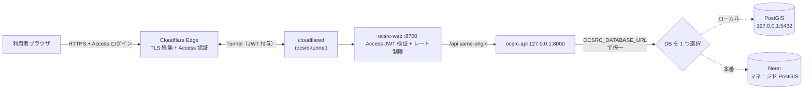

# 📌 バックエンド（FastAPI + PostGIS）本番デプロイ手順

対象: Linux ホスト（systemd）。フロントエンド（`ocsrc-web.service`、`scripts/install-systemd.sh` で導入）と同じホストに、API（`ocsrc-api.service`）を **127.0.0.1 バインド**で常駐させ、DB（PostGIS）は docker compose で稼働させる手順。

## 🗺️ 構成

```
LAN クライアント
   │  http://<ホスト>:8700
   ▼
ocsrc-web.service (systemd, 0.0.0.0:8700, server.mjs)
   │  /api same-origin プロキシ（環境変数 OCSRC_BACKEND_ORIGIN、Issue #35）
   ▼
ocsrc-api.service (systemd, 127.0.0.1:8000, uvicorn + backend/.venv)
   │  OCSRC_DATABASE_URL（/etc/ocsrc/api.env から注入）
   ▼
ocsrc-db (docker compose, PostGIS, 127.0.0.1:5432)
```

- ⚠️ API は **LAN へ直接露出しない**（127.0.0.1 バインド維持・多層防御）。SPA からの接続は `server.mjs` の same-origin プロキシ経由
- 🔐 DB 資格情報はリポジトリ外の `/etc/ocsrc/api.env`（root:root, 600）で管理する
- docker compose の `backend` コンテナ（`ocsrc-backend`）は**起動しない**（`db` のみ起動）。systemd 経路と併用するとポートが二重になるため、どちらか一方に統一する

## 📋 前提

| 項目 | 内容 |
|---|---|
| OS | Linux（systemd） |
| ソフトウェア | `python3`（venv 可）、`docker` + `docker compose`、`ss`（iproute2） |
| フロントエンド | `scripts/install-systemd.sh` 導入済み（未導入でも API 単体は動作可） |
| venv | `scripts/install-systemd-api.sh` が `backend/.venv` を自動構築（`backend/requirements.txt`） |

### 1. DB（PostGIS）を docker compose で起動する

```bash
cd infra
cp .env.example .env        # 初回のみ。実運用パスワードへ必ず変更（下記参照）
docker compose --profile phase2 up -d db
docker compose ps           # ocsrc-db が healthy になるまで待つ
```

- ⚠️ `infra/.env.example` の `OCSRC_DB_PASSWORD=dev_only_password` は**開発専用**。本番ホストでは必ず強パスワードへ変更してから初回起動すること（「🔐 パスワード運用」参照）
- `infra/.env` はコミット対象外（.gitignore 済み）。DB は `127.0.0.1:5432` のみへバインドされ、LAN からは到達できない

### 2. KSJ データ投入

河川・施設データの入手と `python -m app.ingest` による投入手順は [`backend/data/README.md`](../backend/data/README.md) を参照（NII Geoshape 経由の実データ取込が検証済みルート）。同一 `(dataset, source)` の再実行は洗い替えで冪等。

## 🚀 インストール

```bash
scripts/install-systemd-api.sh             # ポートは既存設定 or 8000-8099 から自動選択
PORT=8010 scripts/install-systemd-api.sh   # ポート明示
```

一般ユーザで実行する（sudo は内部の必要箇所のみ）。スクリプトは冪等（再実行安全）で、以下を行う:

1. `backend/.venv` を構築し `requirements.txt` をインストール
2. 空きポートを検出（明示 `PORT` > 既存ユニットの `--port` > 8000〜8099 を探索）
3. `/etc/ocsrc/api.env` を生成（**既存ファイルは上書きしない**、root:root / 600）
4. `/etc/systemd/system/ocsrc-api.service` を生成して `enable` + `restart`
5. `ocsrc-web.service` に `Environment=OCSRC_BACKEND_ORIGIN=http://127.0.0.1:<APIポート>` を注入（値が変わったときだけ web を再起動）

### DB パスワードの設定（初回必須）

生成直後の `/etc/ocsrc/api.env` の DSN はプレースホルダ `CHANGE_ME_STRONG_PASSWORD` のため、そのままでは DB へ接続できない（healthz の `db` が `error` になる）:

```bash
sudoedit /etc/ocsrc/api.env    # CHANGE_ME_STRONG_PASSWORD を実パスワードへ置換
sudo systemctl restart ocsrc-api
```

## ✅ ヘルス確認

```bash
curl http://127.0.0.1:8000/healthz
# → {"status":"ok","db":"ok","version":"0.2.0"}
```

| `db` の値 | 意味 | 対処 |
|---|---|---|
| `ok` | DB 接続成功 | — |
| `error` | 接続失敗（パスワード不一致・DB 未起動・ポート違い） | `/etc/ocsrc/api.env` の DSN と `docker compose ps` を確認 |
| `not_configured` | `OCSRC_DATABASE_URL` 未設定 | `EnvironmentFile` の読込を確認 |
| `unavailable` | asyncpg 未導入 | venv を再構築（インストーラ再実行） |

API 疎通・空間検索の確認:

```bash
curl http://127.0.0.1:8000/api/v1/ping
curl "http://127.0.0.1:8000/api/v1/nearby?lat=35.6845&lon=139.7730&radius_m=1000"
```

## 📄 ログ確認

```bash
journalctl -u ocsrc-api -f                    # 追尾
journalctl -u ocsrc-api --since "1 hour ago"  # 直近 1 時間
systemctl status ocsrc-api                    # 稼働状態
```

## 🔁 停止・無効化・削除

```bash
sudo systemctl stop ocsrc-api          # 一時停止（次回ブートでは起動する）
sudo systemctl disable --now ocsrc-api # 停止 + 自動起動無効化
scripts/uninstall-systemd-api.sh       # ユニット削除 + web への注入行も除去
```

- アンインストーラは `/etc/ocsrc/api.env`（DB 資格情報）を**保持**する。完全に消す場合は `sudo rm -f /etc/ocsrc/api.env`
- DB の停止は `cd infra && docker compose --profile phase2 stop db`（データは volume `pgdata` に残る）

## 🔐 パスワード運用（OCSRC_DB_PASSWORD の本番 override）

⚠️ `infra/.env.example` の `dev_only_password` は**ローカル開発専用**であり、本番・共有環境では絶対に使わない。

### 強パスワードの生成

```bash
openssl rand -hex 24
```

> 💡 hex（`0-9a-f`）を推奨。base64 だと `/` `+` `=` が混ざり、`OCSRC_DATABASE_URL` の DSN 内で URL エンコードが必要になる。

### 新規ホスト（DB 初回起動前）

1. `infra/.env` の `OCSRC_DB_PASSWORD` を生成したパスワードに設定
2. `docker compose --profile phase2 up -d db`（初回の volume 初期化時に反映される）
3. `/etc/ocsrc/api.env` の DSN に同じパスワードを設定 → `sudo systemctl restart ocsrc-api`

### 稼働中 DB のパスワード変更

`POSTGRES_PASSWORD` は volume 初期化時のみ参照されるため、既存 DB は SQL で変更する:

```bash
docker exec -it ocsrc-db psql -U app -d site_risk_checker \
  -c "ALTER USER app WITH PASSWORD '新しい強パスワード';"
```

その後、両方の設定を一致させて再起動:

1. `infra/.env` の `OCSRC_DB_PASSWORD` を更新（次回コンテナ再作成との整合のため）
2. `/etc/ocsrc/api.env` の DSN を更新 → `sudo systemctl restart ocsrc-api`
3. `curl http://127.0.0.1:8000/healthz` で `"db":"ok"` を確認

## ⚠️ トラブルシュート

| 症状 | 原因候補 | 確認コマンド |
|---|---|---|
| `db: error` | パスワード不一致 / DB 停止 / ポート違い | `docker compose ps`、`journalctl -u ocsrc-api -n 50` |
| SPA で API 呼び出しが 502 | `ocsrc-api` 停止中（プロキシは 502 を返す設計） | `systemctl status ocsrc-api` |
| ユニット起動失敗（203/EXEC） | `backend/.venv` 欠損・root 所有 | `ls -l backend/.venv/bin/uvicorn`。インストーラを一般ユーザで再実行 |
| ポート衝突 | docker の `ocsrc-backend` コンテナと二重起動 | `docker ps`、`ss -ltn 'sport = :8000'` |

---

## 🐘 マネージド DB（Neon）を使う

ローカル PostGIS の代わりに **Neon（マネージド PostgreSQL + PostGIS）** を本番 DB にできます。docker の DB コンテナが不要になり、可用性・バックアップは Neon 側に委譲されます。

> 📖 稼働中の Neon プロジェクトの構成・スキーマ・監視・バックアップ方針は [`neon-database.md`](./neon-database.md) を参照。本節は初回セットアップ手順のみを扱う。

| 項目 | 値 |
|---|---|
| PostgreSQL | 17 系 |
| PostGIS | 3.5（`CREATE EXTENSION postgis` を 1 回実行） |
| 接続 | TLS 必須（DSN に `?sslmode=require`） |
| 選択方法 | `/etc/ocsrc/api.env` の `OCSRC_DATABASE_URL` を Neon の接続文字列にするだけ |

手順:

接続文字列は秘密情報です。**コマンド引数やシェル履歴に平文で残さない**よう、`read -s` で環境変数に読み込んでから使います。

```bash
# 1. Neon コンソールでプロジェクト作成 → 接続文字列を取得（sslmode=require を付与）
# 2. DSN を対話入力（-s で非エコー・履歴に残らない。sslmode=require を含めること）
read -rs -p "Neon DSN: " OCSRC_DATABASE_URL; export OCSRC_DATABASE_URL; echo

# 3. PostGIS 拡張を有効化（export 済み変数を直接使い、引数に資格情報リテラルを置かない）
psql "$OCSRC_DATABASE_URL" -c "CREATE EXTENSION IF NOT EXISTS postgis;"

# 4. KSJ データを投入（ローカルと同じ ingest CLI。接続先は環境変数から取得）
cd backend
.venv/bin/python -m app.ingest data/raw/arakawa-stream.json \
  --dataset river \
  --source "国土数値情報河川データセット（NII作成）「国土数値情報（河川データ）」（国土交通省）を加工、CC BY 4.0" \
  --source-updated "国土数値情報 W05（NII Geoshape 経由取得）" --name-key W05_004

# 5. API を Neon 向きに切替（api.env を直接編集して DSN を貼り付け。sed に資格情報を渡さない）
sudo install -m 600 -o root -g root /dev/stdin /etc/ocsrc/api.env <<EOF
OCSRC_APP_ENV=production
OCSRC_DATABASE_URL=${OCSRC_DATABASE_URL}
EOF
sudo systemctl restart ocsrc-api
curl -s http://127.0.0.1:8000/healthz   # → {"status":"ok","db":"ok",...}

# 6. 環境変数から DSN を消す（任意）
unset OCSRC_DATABASE_URL
```

> 接続文字列は秘密情報です。`/etc/ocsrc/api.env`（600・リポジトリ外）だけに置き、コミット・ログ出力しないこと。`read -s` で入力すれば `~/.bash_history` にも残りません。

---

## 🌐 インターネット公開（Cloudflare Tunnel + Cloudflare Access）

LAN 内利用は認証不要のままで、**インターネット公開時のみ** Cloudflare Tunnel（TLS 終端）＋ **Cloudflare Access**（ID ベース認証・Issue #70）を通します。共有パスワードは持たず、誰を許可するかは Access アプリのポリシー（メール / OTP / IdP）で管理します。要件 §11.3.1（TLS + 認証 + レート制限）を満たす構成です。



### 1. Cloudflare Access アプリの作成（公開前に必須・ダッシュボード）

未設定のまま Tunnel 経由アクセスが来ると `server.mjs` は **503** を返します（設定漏れのまま公開されない fail-safe）。まず Zero Trust ダッシュボードで Access アプリを作成します（API では作成不可・アクセス許可の管理はここで行う）:

1. **Zero Trust** → **Access** → **Applications** → **Add an application** → **Self-hosted**
2. Application domain = `riskchecker.mirai-dx-platform.com`
3. **Policy** を追加（例: Action=Allow / Include=Emails に許可メールを列挙、または Emails ending in / One-time PIN）
4. 作成後、アプリの **Overview** で **Application Audience (AUD) Tag** をコピー
5. チームドメイン（`<team>.cloudflareaccess.com`）は **Settings → Custom Pages** 等で確認

取得した AUD とチームドメインを web.env に設定します（値は秘密ではないが 600 で一元管理）:

```bash
sudo install -m 600 /dev/null /etc/ocsrc/web.env
printf 'OCSRC_ACCESS_TEAM_DOMAIN=%s\nOCSRC_ACCESS_AUD=%s\n' \
  '<team>.cloudflareaccess.com' '<application-aud-tag>' | sudo tee /etc/ocsrc/web.env >/dev/null
sudo chmod 600 /etc/ocsrc/web.env
# unit に EnvironmentFile を反映して再起動
bash scripts/install-systemd.sh
```

| 挙動 | 条件 |
|---|---|
| 認証なしで通す | LAN 直アクセス（`cf-connecting-ip` ヘッダなし） |
| Access ログインを要求 | Tunnel 経由（エッジで未認証は Access ログイン画面へ） |
| 有効 JWT を要求（多層防御） | origin で `Cf-Access-Jwt-Assertion` を署名・aud・iss・exp 検証。無効/欠如は **403** |
| 503 で拒否 | Tunnel 経由かつ Access 未設定（fail-safe） |
| 429 で拒否 | 同一 IP から 60 秒に 10 回検証失敗（レート制限） |
| 認証なしで通す（origin側の意図） | `/healthz` の完全一致のみ（死活監視用）。`server.mjs` の `checkTunnelAuth` は `/healthz` を除外済み |

> ⚠️ **既知のギャップ（Issue #94・本書更新時点で未解決）**: 上表の `/healthz` 例外は **origin（`server.mjs`）側のロジックのみ**。Cloudflare Access の **エッジ層**では `riskchecker.mirai-dx-platform.com` 全体を保護する Access アプリが `/healthz` にも適用されるため、実際には未認証アクセスがエッジで 302（Access ログインへのリダイレクト）される（2026-07-14 に `curl` で確認）。外形監視（UptimeRobot 等）で `/healthz` を使う場合は、`riskchecker.mirai-dx-platform.com/healthz` 専用の Access アプリケーションを作成し `bypass` ポリシーを設定する必要がある。手順は Issue #94 のコメントを参照。

> アクセス許可の追加・削除（誰を入れるか）は **Access アプリのポリシー**をダッシュボードで編集するだけで即反映されます。パスワードの再配布は不要です。
>
> **🔒 ネットワーク境界（重要・多層防御）**: origin の JWT 検証は「Tunnel 経由（Cloudflare が付与する `cf-connecting-ip` あり）」のリクエストにのみ効きます。`server.mjs` は `0.0.0.0:8700` で待ち受けるため、**信頼できないネットワークから 8700 に直接到達できると `cf-connecting-ip` なし＝認証なしで通ってしまいます**。Cloudflare Tunnel はアウトバウンド専用でインバウンドのポート開放を必要としないので、**8700 を WAN へ port-forward しないこと**。インターネットからの到達は必ず Tunnel（＝エッジ Access）だけに限定し、8700 は LAN 内のみ到達可能に保ってください（本番ホストが NAT 配下のプライベート IP であることが前提）。

### 2. Tunnel の作成と常駐化

```bash
cloudflared tunnel login                         # 初回のみ（cert.pem 取得）
cloudflared tunnel create ocsrc-riskchecker      # トンネル作成
# ~/.cloudflared/ocsrc-config.yml に tunnel id + ingress(:8700) + credentials-file を記述
bash scripts/install-tunnel.sh                   # systemd 常駐（認証未設定なら中断）
```

### 3. 一般公開（DNS ルート = 公開スイッチ）

DNS ルートを作成した瞬間に外部から到達可能になります。**この操作が公開の意思決定点**です。

```bash
cloudflared tunnel route dns ocsrc-riskchecker riskchecker.mirai-dx-platform.com
# または: CREATE_DNS_ROUTE=1 bash scripts/install-tunnel.sh
# 公開後: https://riskchecker.mirai-dx-platform.com/ （Cloudflare Access ログイン）
```

切り戻し（非公開化）は DNS レコード削除、または `sudo systemctl stop ocsrc-tunnel` でトンネルを止めます。

### 4. 現状の稼働状況（Cloudflare API MCP で確認・2026-07-14 時点のスナップショット）

Monitor フェーズで CTO が Cloudflare API（読み取り専用）から確認した実態。数値は変動するため、次回 Monitor 時に再確認すること。

| 項目 | 状態 |
|---|---|
| Tunnel 名 / status | `ocsrc-riskchecker` / `healthy` |
| 接続数 | 4 本（東京近郊 colo: `nrt05` / `nrt12` / `nrt14` / `nrt15` に分散。Tunnel 1本が複数エッジに冗長接続する標準構成） |
| Access アプリ（既存） | `riskchecker`（`riskchecker.mirai-dx-platform.com` 全体を保護）。2026-07-11 作成後は更新なし＝ Issue #94 の `/healthz` bypass 専用アプリは未作成 |
| Alerting policy | **0 件**。Cloudflare 側の通知は現状未設定（ダッシュボード設定は要ユーザー判断）。**ローカル側の代替として ocsrc-watchdog（下記 §5）が web / api / DB / tunnel / エッジの死活を 5 分間隔で監視し、異常時に GitHub Issue で通知する** |
| Workers / Pages | 未使用（0 件）。本プロジェクトは Tunnel + Access 構成のみで、Workers/Pages には依存しない |

> 🔧 Cloudflare API（MCP経由）は読み取り専用スコープのみ付与されている（Access アプリ作成等の書き込みは `10000: Authentication error` で失敗）。ダッシュボードでの作成・変更はユーザーが行う。

#### 🧭 運用チェックリスト（Monitor フェーズで確認する項目）

- [ ] `cloudflared tunnel info ocsrc-riskchecker` または Cloudflare API で Tunnel が `healthy` か確認
- [ ] Access アプリのポリシー変更がないか（許可メール一覧など）確認
- [ ] `curl -I https://riskchecker.mirai-dx-platform.com/` が Access ログインへリダイレクトすること（保護が外れていないこと）を確認
- [ ] `systemctl list-timers ocsrc-watchdog.timer` で watchdog が稼働していること、ラベル `watchdog` の open Issue（未対応の障害）がないことを確認
- [ ] **改善提案**: Cloudflare 側の Alerting policy は 0 件のまま。Zero Trust ダッシュボードでの通知設定（メール等）を引き続き推奨（要ユーザー判断。ローカル watchdog はホスト自体の電源断・ネットワーク断を検知できないため、エッジ側通知との併用が完全形）

### 5. ローカル watchdog による死活監視と Issue 通知（ocsrc-watchdog）

Cloudflare Alerting・外形監視（Issue #94）が未設定でも通知を成立させるための、ホスト内蔵の監視。
`scripts/ocsrc-watchdog.sh` が systemd timer（5 分間隔）で次を確認し、**異常時は GitHub Issue（ラベル `watchdog`）を自動起票**する。GitHub の watch 通知（メール/モバイル）がそのままアラートになる。

| チェック | 内容 |
|---|---|
| systemd | `ocsrc-web` / `ocsrc-api` / `ocsrc-tunnel` が `active` |
| web | `127.0.0.1:8700/healthz` が 200 |
| api + DB | `127.0.0.1:8000/healthz` が 200 かつ `"db":"ok"`（Neon 到達性込み） |
| edge | 公開 URL `/healthz` が 200/302（DNS・TLS・エッジ経路の死活。302 = Access 正常） |

```bash
bash scripts/install-systemd-watchdog.sh    # timer 常駐化 + 初回チェック即時実行
systemctl list-timers ocsrc-watchdog.timer  # スケジュール確認
journalctl -u ocsrc-watchdog.service -n 20  # 直近の判定ログ
bash scripts/uninstall-systemd-watchdog.sh  # 撤去（rollback）
```

- 異常が継続しても Issue は乱立せず、既存の open Issue へコメント追記される（1 障害 = 1 Issue）
- 全項目回復を検知すると回復コメントを付けて自動クローズする（障害の開始/終了が Issue に証跡として残る）
- 通知には実行ユーザーの `gh` CLI 認証を使用する（secret の新規保存は不要）。`gh auth status` が通ることが前提
- **限界**: ① エッジ 302 は Access がTunnel より手前で応答するため Tunnel 死活を含まない（Tunnel は systemd active で担保）。② ホスト自体の電源断・ネット断は自己検知できない（Cloudflare 側 Alerting または外形監視の併用を推奨）

## 🚚 main マージ後の本番反映（重要な注意点）

**このプロジェクトは開発機＝本番機の単一ホスト構成であり、GitHub Actions の CI（`.github/workflows/ci.yml`）は lint / typecheck / test / build / security のみで、本番への自動デプロイ工程を含まない。** つまり `main` へ PR がマージされても、このホスト上で明示的にビルドし直すまで本番配信には反映されない。

| コンポーネント | 反映トリガー | 反映方法 | サービス再起動 |
|---|---|---|---|
| フロントエンド（`ocsrc-web`） | 手動 | `cd frontend && npm run build` で `dist/` を再生成 | **不要**（`server.mjs` はリクエスト毎に `dist` を stat する設計のため無停止で切り替わる） |
| バックエンド（`ocsrc-api`） | 手動 | `git pull` 後、依存変更があれば `backend/.venv` を更新 | **必要**（`sudo systemctl restart ocsrc-api`） |

⚠️ **注意**: 開発作業用のブランチ（未マージ）から `npm run build` を実行すると、未マージの変更がそのまま本番へ漏れ出す。ビルド前に必ず `git branch --show-current` が `main` であり、`git log -1` が `origin/main` の最新コミットと一致することを確認すること（`ensure-web-build.sh` は `dist/index.html` が存在する限り自動再生成しないため、放置すると古い内容が配信され続ける、または逆に未マージの内容が配信され続ける事故につながる）。
